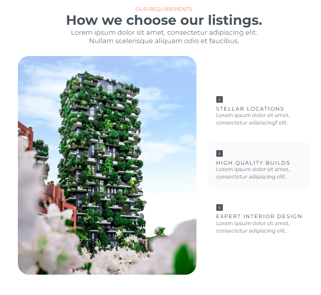

# Estate-Landing-Page (My first PET-project)

[Here you can check it](https://artemuholkov.github.io/Estate-Landing-Page/)

---

I had figma design for this project.
This landing page is 100% responsive for all types of screens.
I used HTML, CSS, JS in this project.

---

### What was interesting in this project:

1. Switcher. In this section image changing after you click on other item in menu on the right side

2. Popup images on click. Description been taken from image alt option.

3. Boostrap slider

4. My own infinite slider created without boostrap, swiperslider, etc.

---
